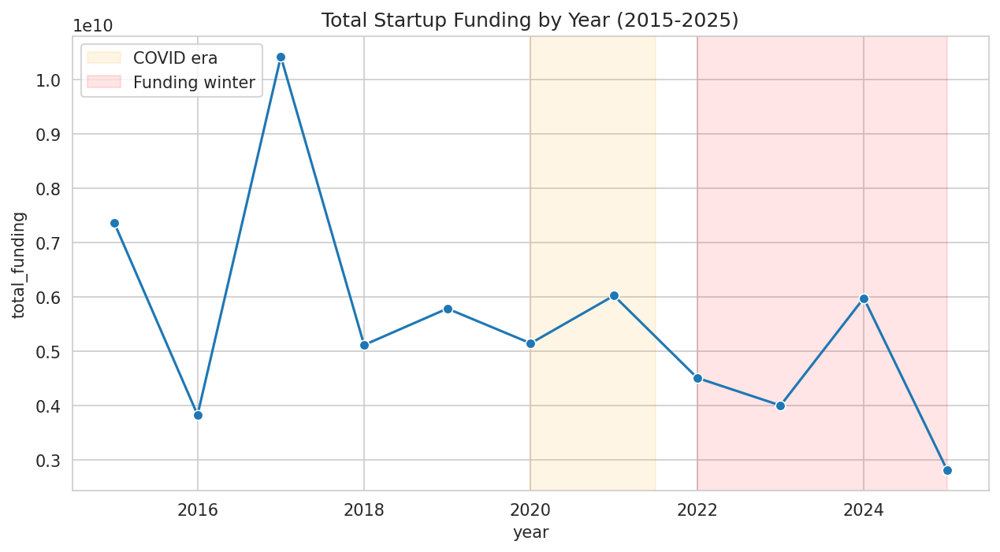
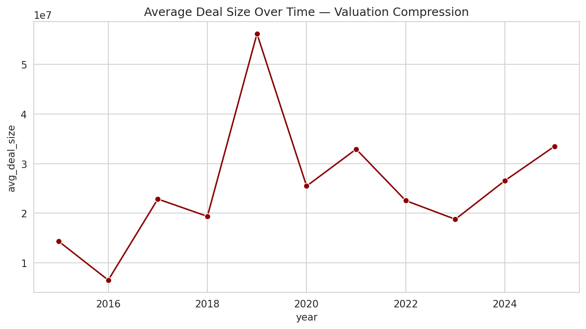
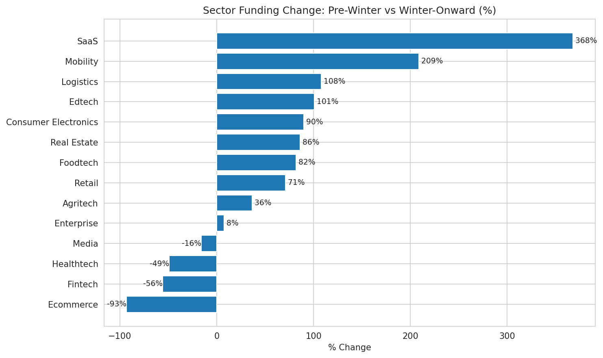

# Indian Startup Funding Analysis (2015–2025)

Python, SQLite, Pandas, Matplotlib, Seaborn

## Overview

An end-to-end analysis of Indian startup funding trends across a decade (2015–2025), built by merging two multi-year Kaggle datasets, cleaning and standardizing inconsistent fields, and running SQL-based aggregations to uncover funding trends through India's "funding winter" period.

## Key Findings

- Merged and cleaned two multi-year datasets (2015–2019, 2020–2025) covering 4,000+ funding rounds; audited and corrected data quality issues including a misrecorded currency entry, and consolidated 576 raw sector labels into 20 standardized categories using SQL aggregations, CTEs, and window functions.
- Uncovered a sharp funding contraction from a peak of approx. $10.4B (2017) to approx. $2.8B (2025), while average deal size remained comparatively resilient (approx. $19–33M range post-2020) — indicating the funding winter reduced deal *volume and total capital* more than it compressed individual deal sizes.
- Identified diverging sector trends using year-over-year window functions: SaaS (+368%) and Mobility (+209%) funding grew through the winter period, while Ecommerce (−93%) and Fintech (−56%) saw the steepest pullbacks.

## Visualizations

### Total Funding by Year

### Average Deal Size Over Time

### Sector Funding Change: Pre-Winter vs Winter-Onward

## Methodology

1. **Data Merging** — Combined two datasets with differing schemas (column names, date formats, currency notation) into a single unified table.
2. **Data Cleaning** — Standardized currency fields (removed commas/symbols), parsed inconsistent date formats, and audited for outliers/data errors (e.g., a misrecorded $3.9B entry for a startup that never raised at that scale).
3. **Sector Standardization** — Consolidated 576 raw, free-text sector labels (e.g. "Ecommerce", "E-Commerce", "eCommerce") into 20 clean categories to enable meaningful aggregation.
4. **SQL Analysis** — Loaded cleaned data into SQLite and used CTEs and window functions (`LAG()`) to compute year-over-year trends per sector.
5. **Visualization** — Built trend, compression, and sector-rotation charts using Matplotlib/Seaborn.

## Data Sources

- [Indian Startup Funding (2015–2019)](https://www.kaggle.com/datasets/sudalairajkumar/indian-startup-funding) — Kaggle
- [Indian Startup Funding Dataset (2020–2025)](https://www.kaggle.com/datasets/vagdevititikshag/indian-startup-funding-dataset-20202025) — Kaggle

## Files

- `startup_funding_analysis.ipynb` — Full analysis notebook (data cleaning, SQL queries, visualizations)
- `cleaned_startup_funding.csv` — Final merged and cleaned dataset
- `yearly_funding_trend.png`, `valuation_compression.png`, `sector_rotation.png` — Output visualizations
